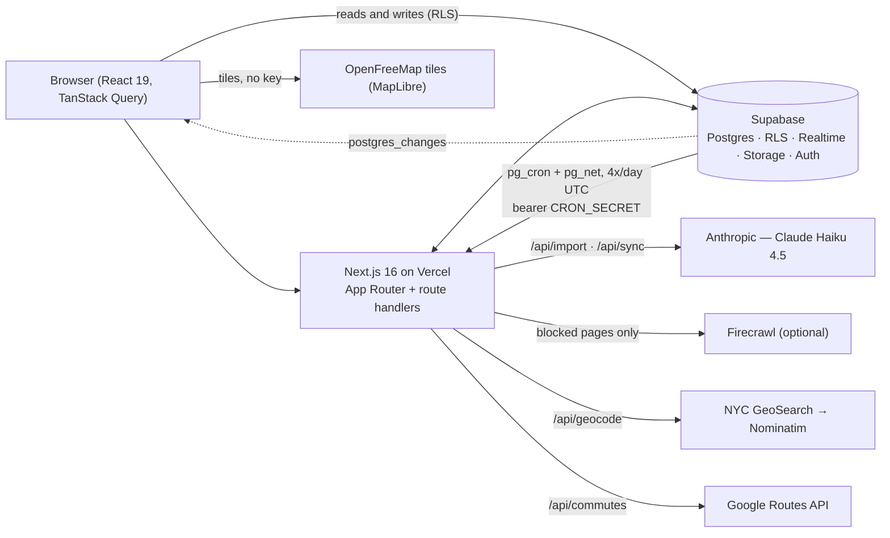

# Apartment Quest

A private NYC apartment-hunt tracker for a group of four. It keeps every listing
anyone finds in one table, imports most of a listing's details from its URL,
forces a next action every time someone talks to a broker, and answers the two
questions a spreadsheet never could — *where is this, and how long is the
commute*. Next.js 16 + Supabase + Vercel, deployed once and shared behind a
single password.

**Why**: four people hunting together generate the same three failures — the
same link pasted twice, a broker who stopped replying and nobody noticed, and a
listing that quietly went off-market while it sat in the group chat. This is the
tool that catches all three.

> Screenshots: coming — see [`docs/`](docs/).

## Features

**Track** — listings table (sortable, 14 filters, inline edit) and mobile cards;
beds/baths/rent/sqft/fee, amenities (laundry, dishwasher, AC, outdoor space) and
pet policy; broker records; combined 40x qualification math across the four
incomes; dedupe on add plus a `merge_listings` RPC for post-hoc duplicates.

**Import** — paste a listing URL and get a filled-in form: direct fetch →
Firecrawl (optional) → paste box, then one forced Claude Haiku tool call whose
every value is re-checked server-side. Photos are pulled off the page in the same
pass; imported values fill blanks only, never overwrite what you typed.

**Follow-up** — Home is a queue, not a gallery: Overdue / Today / Vanished? /
Gone quiet / New. Logging a contact prompts for the next action and due date, and
that prompt cannot be dismissed. Activity feed underneath, colour-coded by person.

**Chat & votes** — a group thread plus a thread per listing, Supabase Realtime,
unread badges per person; yes/maybe/no votes with comments, shown on every row.

**Maps & commute** — MapLibre + OpenFreeMap basemap (repainted to match the
theme), listing pins in each finder's colour, a subway-station layer, shared
saved locations (work, gym, parents), and cached walk / bike / transit times from
the Google Routes API.

**Sync** — twice a day every listing with a URL is re-checked and classified
(404 → site status code → page text → Haiku confirmation). It writes a separate
`listing_state` column and never touches your own `status`: a page that vanished
is news, and "Mark lost" is still a human decision.

## Architecture



The browser talks to Postgres directly for reads and writes (RLS-guarded,
Realtime for invalidation). Anything holding a key or a secret is a route handler
on Vercel: `/api/import`, `/api/photos`, `/api/sync`, `/api/geocode`,
`/api/commutes`. Supabase's own `pg_cron` is the scheduler, because Vercel Hobby
crons run once a day in UTC and "midnight and noon in New York" needs a timezone.

More detail: [`docs/ARCHITECTURE.md`](docs/ARCHITECTURE.md).

## Security model

- **One shared password.** A single Supabase auth user; the login screen is
  password-only and the account's email is an internal identifier that is never
  rendered. Sessions persist per device.
- **Then a person picker.** After login each device picks which of the four
  people it is, stored in localStorage. That is attribution, not authentication.
- **RLS on every table**, one policy each. Postgres enforces it regardless of
  what the client does — the anon key alone reads nothing.
- **Pinned to one uid.** Those policies do not test "is this session
  authenticated", they test `public.is_app_user()` — true only for the single
  auth user whose uid you store in `app_config` (migration `0011`, applied with
  `supabase/owner.sql.example`). `auth.role() = 'authenticated'` would mean
  "any session Supabase will issue", which is safe exactly as long as signups
  and anonymous sign-ins stay switched off in the dashboard — two checkboxes.
  The pin is defence in depth so the database stops depending on them. It fails
  closed: no JWT, an anonymous JWT or a missing `owner_uid` row all read empty.
  `app_config` itself has RLS on with **no policies** and its grants revoked, so
  nothing holding the anon key can even see which uid is nominated.
- **Server-only keys.** `ANTHROPIC_API_KEY`, `FIRECRAWL_API_KEY`,
  `SUPABASE_SERVICE_ROLE_KEY`, `GOOGLE_MAPS_API_KEY` and `CRON_SECRET` are never
  `NEXT_PUBLIC_`. The service-role client imports `server-only`, so an accidental
  client import is a build error rather than a leaked key.
- **Bearer-secret cron routes.** `/api/sync`, `/api/geocode` and `/api/commutes`
  accept either a logged-in session or `Authorization: Bearer $CRON_SECRET`,
  compared with `timingSafeEqual`. A session may only sync one named listing,
  never a whole crawl.
- **SSRF guards.** Every URL a human supplies (import, imported photos) goes
  through `assertSafeUrl`: http(s) only, no credentials, ports 80/443, DNS
  resolved and loopback / private / CGNAT / link-local / ULA / multicast
  rejected, re-checked on every redirect hop.
- **Cost guards.** The import route checks the session *before* it reads the
  body, so nobody can spend tokens with the anon key. Commute lookups are cached
  and the freshness read fails closed rather than re-buying rows. Outside
  production, Google Routes calls are dry-run unless `AQ_ROUTES_LIVE=1`.

**What this is not:** there are no per-user accounts, no per-person permissions
and no audit boundary. Everyone who has the password sees and edits everything,
including each other's votes and incomes. That is deliberate for a private group
of four, and it is the wrong model for anything larger or public.

## Getting started

**Prerequisites**: Node 20+, pnpm 11, a free Supabase project. Optional: an
Anthropic API key (URL import), a Google Cloud key with the Routes API enabled
(commute times), a Firecrawl key (blocked listing sites).

```bash
pnpm i
cp .env.example .env.local   # fill in from the Supabase dashboard
```

**Database.** There is no local Supabase stack and no CLI link — SQL is applied
by hand, via the SQL editor or the Supabase MCP `apply_migration` tool. Apply
`supabase/migrations/` in this order:

```
0001 → 0002 → 0003 → 0004 → 0005 → 0007 → 0006 → 0008 → 0009 → 0010 → 0011
```

Numbering quirk: **0007 (photos) applies before 0006 (listing sync).** Photos
shipped first and took the next free number; 0006 was written afterwards against
a schema that already had 0007 in it. Everything else is filename order. Then run
`supabase/seed.sql` (the four people; idempotent).

**Auth user.** In the Supabase dashboard: create one user with auto-confirm on,
using an address on a domain you control (fake TLDs like `.local` are sometimes
rejected). Then turn **off** signups and email confirmations so no second account
can exist. Put that address in `NEXT_PUBLIC_APP_LOGIN_EMAIL`.

**Owner uid.** `0011` pins every RLS policy to one specific auth user, and it
fails closed — until you name that user, every table reads empty. Copy the uid
of the account you just made (Authentication → **Users** → your user → *User
UID*), paste it into a copy of `supabase/owner.sql.example` in place of
`REPLACE_WITH_AUTH_USER_UID`, and run it in the SQL editor. Do this in the same
sitting as `0011`. If the app logs in but every table is empty, this is the
step: the uid in `app_config` is not the uid you logged in as.

**Environment variables** (`.env.example` documents each one in full):

| Var | Required | Purpose / what breaks without it |
|---|---|---|
| `NEXT_PUBLIC_SUPABASE_URL` | yes | Project URL |
| `NEXT_PUBLIC_SUPABASE_ANON_KEY` | yes | anon / publishable key (`sb_publishable_…` also works) |
| `NEXT_PUBLIC_APP_LOGIN_EMAIL` | yes | Identifier for the one shared auth user. Never rendered. |
| `SUPABASE_SERVICE_ROLE_KEY` | for photos + sync | Server-only. Missing → `/api/photos` 500s, `/api/sync` returns 503 |
| `ANTHROPIC_API_KEY` | for import + sync | Server-only. Missing → `/api/import` returns 503 and the panel says import isn't configured |
| `CRON_SECRET` | for scheduled sync | Server-only bearer token. Missing → every cron call is a 401; "Check now" still works |
| `GOOGLE_MAPS_API_KEY` | for commute times | Server-only, Routes API. Missing → commute cards show "—". The map itself needs no key |
| `FIRECRAWL_API_KEY` | optional | Rung two of the import ladder. Missing → the ladder drops straight to the paste box |
| `AQ_ROUTES_LIVE` | optional | Set to `1` to let a non-production environment actually call Google |

Every optional key degrades to a clear message rather than an error, and missing
env never breaks `pnpm build`.

```bash
pnpm dev   # http://localhost:3000
```

## Deploy

1. Import the repo into Vercel (`main` branch). The build is `pnpm build`; no
   special settings.
2. Set **all** of the variables above — client *and* server-only — for both
   Production and Preview.
3. Schedule the sync: copy `supabase/cron.sql.example`, replace the deployment
   URL and `CRON_SECRET` placeholders, and run it once in the Supabase SQL
   editor. It stores both in Supabase Vault (so `select * from cron.job` cannot
   print the token) and creates four daily `pg_cron` jobs at 04, 05, 16 and 17
   UTC. The route computes the current New York hour and does nothing unless it
   is 0 or 12, so the same four jobs are correct in both EST and EDT — nothing
   needs redeploying in March or November.
4. Restrict the Google Cloud key to the **Routes API only** (and, if you like, to
   your Vercel egress). It is used server-side only, so an HTTP-referrer
   restriction is the wrong kind.

## Costs

Everything is free tier except a few cents of tokens:

| Service | Plan | Notes |
|---|---|---|
| Vercel | Hobby | $0 |
| Supabase | Free | Postgres, Auth, Realtime, Storage, pg_cron |
| OpenFreeMap + MapLibre | free | no key, no account |
| NYC GeoSearch / Nominatim | free | Nominatim rate-limited to 1 req/s, honoured |
| Google Routes API | free tier | 10k Essentials calls/month; ~900 calls *total* for 60 listings × 5 places × 3 modes, cached 30 days |
| Firecrawl | free tier | 500 credits, only used when a site blocks us |
| Anthropic (Haiku 4.5) | pay as you go | ~10k input tokens per import; **cents per month** in practice |

## Attribution

- Map data © [OpenStreetMap](https://www.openstreetmap.org/copyright)
  contributors. Tiles by [OpenFreeMap](https://openfreemap.org/); when the style
  fetch fails the app falls back to CARTO's keyless dark raster tiles
  (© OpenStreetMap contributors © CARTO).
- Rendering by [MapLibre GL JS](https://maplibre.org/).
- Commute durations from the Google Routes API, shown with a **Powered by
  Google** credit wherever a duration appears. Google's terms require it when
  results are displayed without a Google map; removing it is a licence violation,
  as is removing MapLibre's attribution control.
- Subway station data from the MTA via NYC Open Data (dataset
  [`39hk-dx4f`](https://data.ny.gov/d/39hk-dx4f)), bundled as a trimmed GeoJSON
  (445 station complexes).
- Geocoding by [NYC Planning Labs GeoSearch](https://geosearch.planninglabs.nyc/),
  falling back to [Nominatim](https://nominatim.org/) — whose usage policy (1
  req/s, an identifying `User-Agent` from `NOMINATIM_CONTACT`) is implemented,
  not assumed.

Full third-party notices, including MapLibre's BSD-3-Clause text and which
credits are licence *requirements* rather than courtesies, are in
[NOTICE.md](NOTICE.md).

## Development

```bash
pnpm dev     # dev server
pnpm lint    # eslint
pnpm build   # production build
pnpm test    # vitest run — 897 tests across 34 files
```

Run `pnpm lint && pnpm build && pnpm test` before every commit. Tests cover the
pure logic: the import ladder's reducers and coercion, sync classification, queue
bucketing, filters, votes, unread math, time/DST, geo freshness and the map style
transform.

`CLAUDE.md` is the deep dive — every non-obvious decision, its failure mode and
why the alternative was rejected. It is the file to read (or to point an agent
at) before changing anything. `SPEC.md` is the original product spec; where the
two disagree, `CLAUDE.md` records which one won and why.

## Status / roadmap

Built for one real apartment hunt and complete for that purpose.

**Out of scope, by design**

- Per-user accounts or per-person permissions.
- Scraping listing *search* pages — import takes one URL that a human chose.
- Listing-site APIs or a headless browser.

**Possible later**

- A suggestions agent that proposes listings matching the group's filters.
- Documents / share log: the `documents` and `doc_shares` tables exist in the
  schema (phase 5 of `SPEC.md`) but no UI was built.

## License

MIT — see [LICENSE](LICENSE).
